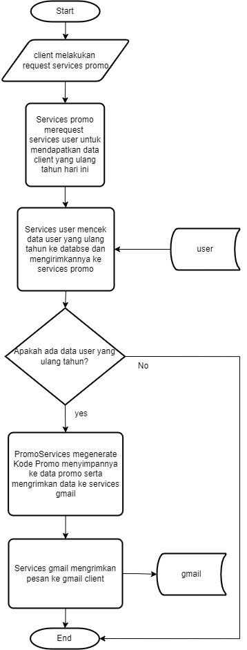
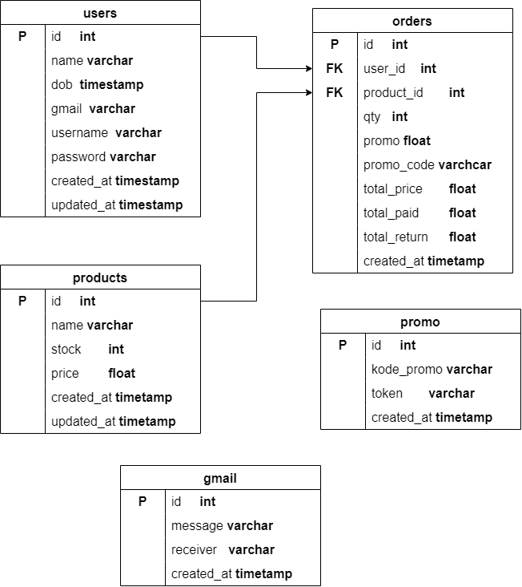

# Assigment Project

## Flowchart

## Table Design

## ENDPOINT

    example run in localhost
    with port 9090
    http://localhost:9090

- users
  [POST] api/user
  to created user
  example request:
  {
  "name":"user2",
  "dob":"2024-03-28 15:48:39.651392",
  "gmail":"user2@mgmail.com",
  "username":"user2",
  "password":"user2"
  }

  [GET] api/user
  to get allUserIsbirthday today

- promo
  [POST] api/promo
  example request:
  {}

  [GET] api/user?kode_promo=
  to find token with kode_promo

- product
  [POST] api/product
  to created data product
  example request:
  {
  "name":"product1",
  "stock":30,
  "price":2000000
  }

  [GET] api/product
  ShowallData product

  [GET] api/product:id
  find product with param id

- gmail
  [POST] api/gmail
  this services call by promo services to send to gmail
  example request:
  {
  "name":"user1",
  "promo":"kodePromo",
  "receiver":"user1@mgmail.com"
  }

- order
  [POST] api/gmail
  example request by client
  {
  "user_id":5,
  "product_id":1,
  "qty":1,
  "promo_code":"HAPPYBIRTHDAYuser2",
  "total_paid":4000000

  }

  [GET] api/gmail
  to fetch all Order

## inforation

    To run this program, first clone the repository. then go to the cmd directory. after that write the command go run main.go  in the terminal.
    If an error occurs in the Katarat/JWT library, use version v0.1.8

- to run customer birthday checks automatically at 1 day intervals uncomment go func() in the main.go file

## env example:

Port=
Host=
Username=
Password=
DBName=
Key=
HostUserServices=
PortUserServices=
hostGmailServices=
PortGmailServices=
hostPromoServices=
PortPromoServices=

## TECKSTACK:

- gin
- postgresql
- JWT token
- TTL cache
